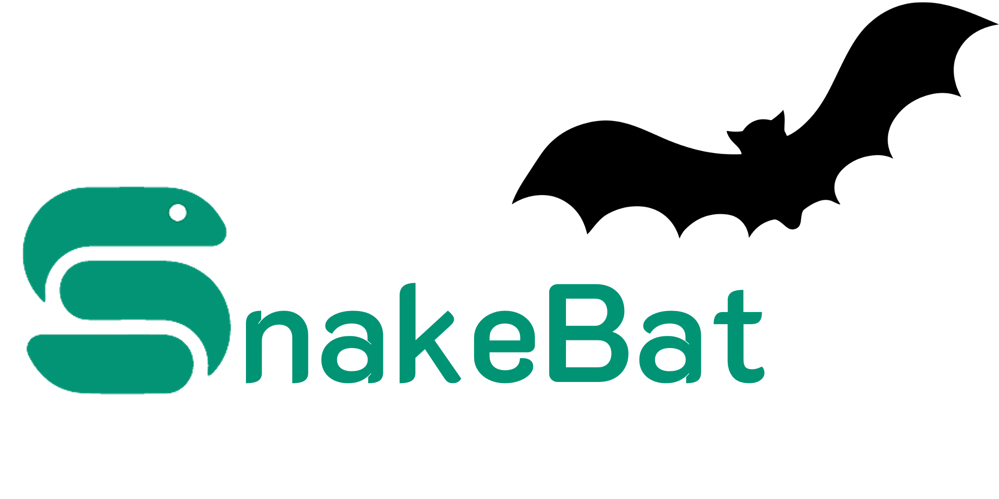

# SnakeBat Pipeline
Snakemake workflow for root mean square (RMS) acoustic energy processing of bat data.




# Table of Contents
- [Introduction](#introduction)
- [Installation](#installation)
- [Implementation](#implementation)
- [Understanding the Outputs](#understanding-the-outputs)
- [Debugging](#debugging)

## Introduction
This repository contains a simple one-rule Snakemake pipeline for calculating root mean square (RMS) power from bat acoustic energy recordings. RMS power is a widely used measure of signal intensity, allowing researchers to quantify the amplitude of bat echolocation calls over time. By automating RMS calcuations across large datasets, this workflow facilitates the analysis of bat activity, call structure, and energy distribution in acoustic monitoring studies in a highly reproducible manner.

**Features**
- Automated processing of .WAV files from multiple sessions (including continuous data, with automatic date partitioning)
- Automated segmenting of recordings based on user-defined durations with flexible bandpass filtering
- Generate RMS and adjusted RMS energy values
- Collate RMS metrics on a per-date basis for continuous data

**Requirements**

All software requirements are listed in the [environment configuration file](https://github.com/mikemartinez99/SnakeBat/edit/main/env_config/snakeBat.yaml)

## Installation

1. Clone the github repository in a location of your choosing.

```shell
git clone https://github.com/mikemartinez99/SnakeBat
```

2. Build conda environment (requires that you have [conda or miniconda](https://docs.conda.io/projects/conda/en/stable/user-guide/install/index.html) installed and configured on your machine.

``` shell
conda env create -f env_config/snakeBat.yaml
```

3. Activate conda environment and install required R packages not available via `conda`. **This only needs to be done during installation**

```shell
# Activate conda environment
conda activate snakeBat
```

Installation of R packages only needs to be done once.
```shell
# Start an interactive R session
R
install.packages("tuneR")
install.packages("seewave")
quit()
```

## Implementation
To implement this pipeline, 3 things are **required**

- `Snakefile`: Directs the flow of the pipeline

- `config.yaml`: Defines crucial variables related to the operation of the pipeline. Ensure you modify variables as needed in valid json format (see example `config.yaml` in repo.)

- `folders.csv`: Defines the list of folders you want to iterate over. This is a 2 column **comma separated** file. The headers for this file should be sample,folder. See example `folders.csv` in repo.

To implement this pipeline:

1. Clone the github repository in a location of your choosing.

```shell
git clone https://github.com/mikemartinez99/SnakeBat
```

2. Activate the SnakeBat conda environment via your terminal you built during installation

```shell
conda activate SnakeBat
```

3. Once your conda environment is activated, the pipeline can be ran in the background via `nohup` with 4 cores, run the following command. This will generate a process ID (PID) for which you can track the status of your job. A file called `nohup.out` will contain Snakemake logging information that would normally be printed out to your terminal. Individual folder logs containing R code information will be stored in the `logs` folder, with one file per folder. Once you submit a nohup job, you can close your computer and the job will safely run in the background. Run the following command via your terminal within the SnakeBat folder:

``` shell
nohup snakemake -s Snakefile --cores 4 &

# Example output showing PID
[1] 79417
```

If running in the background, you can check the job status with the following command:

```shell
jobs -l

# Example output
[1]  + 79417 running    nohup snakemake -s Snakefile --cores 4
```

To kill a background job, run the following command, replacing `<PID> with your process ID
```shell
kill -9 <PID>

# Example
kill -9 79417
```

To run live with 4 cores, run the following
```shell
snakemake -s Snakefile --cores 4
```

## Understanding the Outputs

The SnakeBat pipeline generates two main output folders: `RMS_Power/` and 'Total_RMSE`

``` shell
.
└── SnakeBat/
    ├── RMS_Power/
    │   └── Sample_1/
    │       └── YYYYMMDD/
    ├── Total_RMSE/
    │   └── Sample_1/
    │       └── YYYYMMDD/
    ├── Logs/
    │   └── Sample_1.log
    └── nohup.out
```

**RMS_Power**

Contains subfolders corresponding to each sample listed in `folders.csv`. Each subfolder contains additional subfolders representing each individual date encompassed in the data, named in YYYYMMDD format. Files within these folders contain csv files of RMS energy and adjusted RMS energy per second (each csv file is a 10 minute segment as per the AudioMoth settings.)

**Total_RMSE**

Contains subfolders corresponding to each sample listed in `folders.csv`. Each subfolder contains one csv file per date representing the daily RMS energy total. These files can be concatenated for easier viewing / data manipulation by navigating to the output folder of interest and running the following command. This command concatenates all files, keeping the header of the first file, and dropping the header from all other files. You can change the output file name to whatever you'd like. 

```shell
# Total summary concatenation (get one massive file of daily total RMS energy
awk 'FNR==1 && NR!=1 { next } { print }' *.csv > combined_daily_totals.csv
```

**logs folder**
Contains a log file for each sample. Essentially, this is the R console log which shows the progress from the main R function that applied bandpass filtering. You can see the percentage of your sample that is completed by viewing these logs. 

**nohup.out**
If running in the background with `nohup`, this log shows the progress of the pipeline and verbose Snakemake logging (i.e., number of jobs per rule, etc...)


**done.txt**
`done.txt` is a "dummy" file created by the `rule_all` of this workflow. This file has no meaning or importance other than to signify the end of the pipeline!


## Debugging
**Checklist before you run**

- Did you activate the conda environment? 

```shell
conda activate snakeBat
```
- Are you in the SnakeBat working directory?
- Do all paths in  `folders.csv` point to valid folder paths that exist and contain non-empty files?
- Is `folders.csv` **comma separated?** with no additional whitespace before or after each line?
- Did you modify variables in `config.yaml` to your specifications? If yes, did you save the config.yaml?
- If rerunning, did you unlock the snakemake directory and all outputs that would prevent pipeline from re-running (i.e., outputs from `rule all`?) (more on this below...)

**Re-running an anlysis**
When you launch a Snakemake workflow, it creates a lock on the working directory to make sure that only one instance of Snakemake is writing files there. This prevents two jobs from accidentally overwriting results or corrupting intermediate files if they were run at the same time.
If a workflow crashes, gets killed, or is stopped abruptly, Snakemake may leave the lock file behind in a hidden folder called `.snakemake` (hidden folders can be viewed in your terminal using `ls -a`. Then, when you try to restart the workflow, Snakemake refuses to run because it thinks another process is still active. To unlock your Snakemake directory you have 2 options:

1. The clean way (run this in your terminal within the SnakeBat directory)

```shell
snakemake --unlock
```

2. The quick and dirty way

```shell
rm -r .snakemake
```
Note that a Snakemake workflow will still not re-run even if unlocked if the expected outputs are already generated. Snakemake works off the principal of generating expected outputs. If all expected outputs are present, Snakemake will think there is nothing to be done. In this case, move the output folders and the `done.txt` file

``` shell
rm done.txt
```

